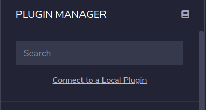
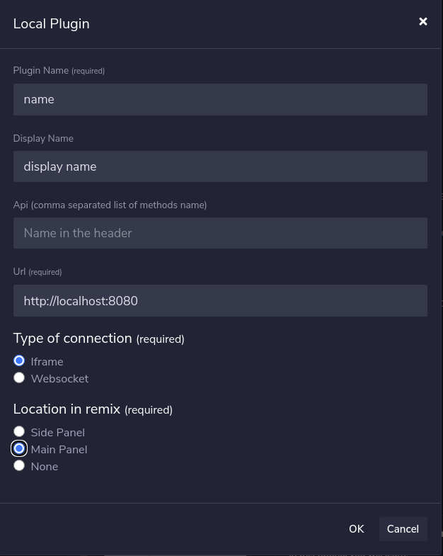

# Remix UMA Playground Plugin

### Project setup
```
git clone git@github.com:Machinalabs/remix-uma-playground.git

yarn

yarn start
```
Be aware that the web application requires Remix in order to fully work, so we need to load the application as a Remix plugin.

Once the application is started. We go to [Remix](http://remix.ethereum.org/) and in the plugin manager we click **Connect to a Local Plugin**


 
Then we fill the form as follows:


